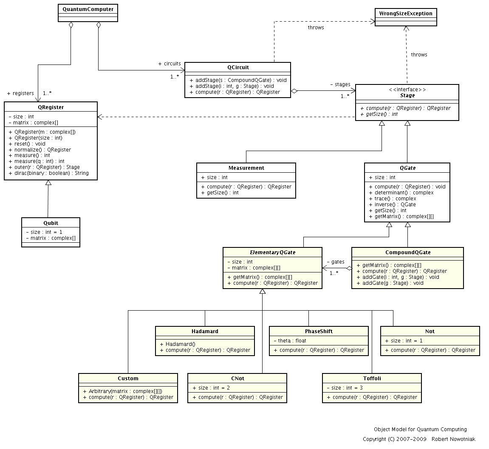
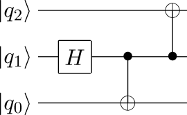
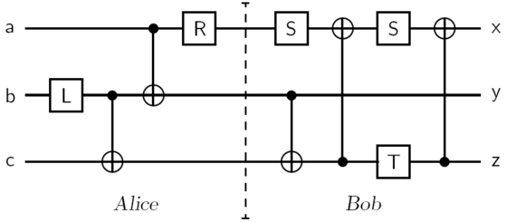

qclib
=====

QCLIB: Quantum Computing library for Python

qclib is a simple Python library which allows to run quantum computing simulations[3,5,6]
on an ordinary computer (the library provides a kind of virtual quantum computer).
The computational complexity of such simulations run on a traditional computer obviously
grows exponentially, and they can be used mainly for educational and demonstrative purposes in
tasks small and trivial in size.

The main library code is [qclib.py](qclib.py), there are also several example
programs included using this library and allowing you to simulate several simple
quantum algorithms in the quantum logic gate model (the Grover's search
algorithm, superdense coding, quantum teleportation protocol).

The library was initially written in Python ver 2, but perhaps I will migrated it
to Python 3 shortly in an experimental branch.

## Object model for Quantum Computing

In order to enable quantum computer simulation I proposed the following object model, which was then implemented in Python in the qclib library.

The suggested model is inspired by an abstract syntax tree structure -
and analogously - it makes it possible to express any computation in the quantum
logic gate model using overloaded operators in Python.



The basic classes of the model are **QRegister**, representing a quantum register, and an
abstract class **QuantumGate**, representing any given quantum gate. Concrete
classes inherit from QuantumGate and overwrite the definition of the *compute*
method. They are the elementary logic gates, like the Hadamard gate,
Controlled-NOT gate, or phase shift gate.

**The qclib library uses overloaded operators to wrap operations on unitary matrices which allows to express any quantum circuits.**
The **operator &ast;&ast;** hides the tensor product operation, while the overloaded
**operator &ast;** hides the composition mapping function, which corresponds to
serial gate connection in a quantum circuit. Moreover, the overloaded
**operator ()** makes it possible to “call” the gates or quantum circuits and
execute them in a way similar to quantum functions. The proposed object
model is a very useful data structure for genetic algorithms processing and
genetic programming (a type of genetic algorithms processing trees or graph
structures).

## Example quantum algorithms

### Entangles states generation quantum circuit[4]

Some very simple quantum circuit example and its implementation in qclib:



```python
from qclib import *

circuit = (I ** Hadamard() ** I) * (I ** CNot()) * (CNot(0, 1) ** I)
result = circuit(ket0 ** ket0 ** ket0)

print result.dirac()
print result
```

### Quantum teleportation protocol[1]



```python
# quantum gates for Brassard teleportation circuit
L = Arbitrary(s2 * array([
    [ 1, -1],
    [ 1,  1],
    ]))
R = Arbitrary(s2 * array([
    [ 1,  1],
    [-1,  1],
    ]))
S = Arbitrary([
    [ 1j,  0],
    [ 0,   1],
    ])
T = Arbitrary([
    [-1,   0],
    [ 0, -1j],
    ])

psi = Qubit([
    [      2.0/7 * (cos(pi/2/9) + 1.0j*sin(pi/2/9)) ],
    [ sqrt(45)/7 * (cos(pi/3*2) + 1.0j*sin(pi/3*2)) ],
    ])


alice = (I ** L ** I) * (I ** cnot) * (cnot ** I) * (R ** I ** I)
bob = (S ** cnot) * (I ** Swap()) * (cnot2 ** I) * \
        (I ** Swap()) * (S ** I ** T) * (I ** Swap()) * (cnot2 ** I) * (I ** Swap())

input = psi ** ket0 ** ket0
qreg = alice(input)
cbits = qreg.measure(1, 2)
output = bob(qreg)

print cbits ** psi # expected cirtuit output
print output # teleporation circuit output
```

### Superdense coding[3]

```python
qregiter = epr()

b1 = 1
b2 = 0

# Perform coding operations on Alice qubit
if b1:
    print (PhaseShift(pi) ** I)
    qregiter = (PhaseShift(pi) ** I)(qregiter)

if b2:
    qregiter = (Not() ** I)(qregiter)

B = Arbitrary([
    [s2,   0,  0,  s2],
    [ 0,  s2, s2,   0],
    [s2,   0,  0, -s2],
    [ 0, -s2, s2 ,  0],
    ])

print B(qregiter).dirac()
```

### Grover’s algorithm[2]

Please check in [grover.py](grover.py) for the full Grover's algorithm implementation in qclib.


## References

1. C. Bennett, G. Brassard, C. Crepeau, R. Jozsa, A. Peres, and W. Wootters. Teleporting an unknown quantum state via dual classical and EPR channels. Phys Rev Lett, pages 1895-1899, 1993. 
1. Lov K. Grover. A fast quantum mechanical algorithm for database search. In STOC ’96: Proceedings of the twenty-eighth annual ACM symposium on Theory of computing, pages 212-219, New York, NY, USA, 1996. ACM Press. 
1. Michael A. Nielsen and Isaac L. Chuang. Quantum Computation and Quantum Information. Cambridge University Press, 2000. 
1. A. Einstein, B. Podolsky, and N. Rosen. Can quantummechanical description of physical reality be considered complete? Phys. Rev., 47(10):777–780, May 1935.
1. [http://robert.nowotniak.com/en/quantum-computing/](http://robert.nowotniak.com/en/quantum-computing/)
1. [Nowotniak, Robert. On the evolutionary design of quantum algorithms (in Polish). 2008, Master’s thesis, Lodz University of Technology, 2008.](http://robert.nowotniak.com/files/rnowotniak-msc.pdf)
1. [Nowotniak, Robert. Analysis of quantum-inspired evolutionary algorithms (in Polish). 2015, Doctoral dissertation, Lodz University of Technology](http://robert.nowotniak.com/files/rnowotniak-phd.pdf)
